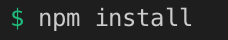
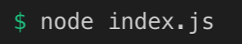

#   Guess the Game of Thrones Character  

## Open your terminal and play this Game of Thrones theme fill-in the blank game

### Game Instructions:  
> You are given five randomly selected Game of Thrones charactors  
> The charactor's name is hidden behind blank spaces  
> Guess the charactor by selcting a letter    
> You are allowed 10 incorrect guesses for each charactor  
> Your final score appears after you complete answers the five charactors    

### Install Game:  
Clone the repository: [link to repository](https://github.com/fcarlone/node-constructor-word-guess/)  
Install the packages associated with this application:  
   
Open your terminal and type the following command to start the game:  
  

### About the Game:  
This is a Node.js application, using class contructors to create new instances of characters.

**Software/libraries used for this application:**  
JavaScript - for the applications logic  
Node.js - to exucute the application in the terminial (outside the browser)  
Inquirer.js - command-line user interface to prompt for and handle user input  
colors.js - to style the Node.js application in the console  

### Video Demo:
